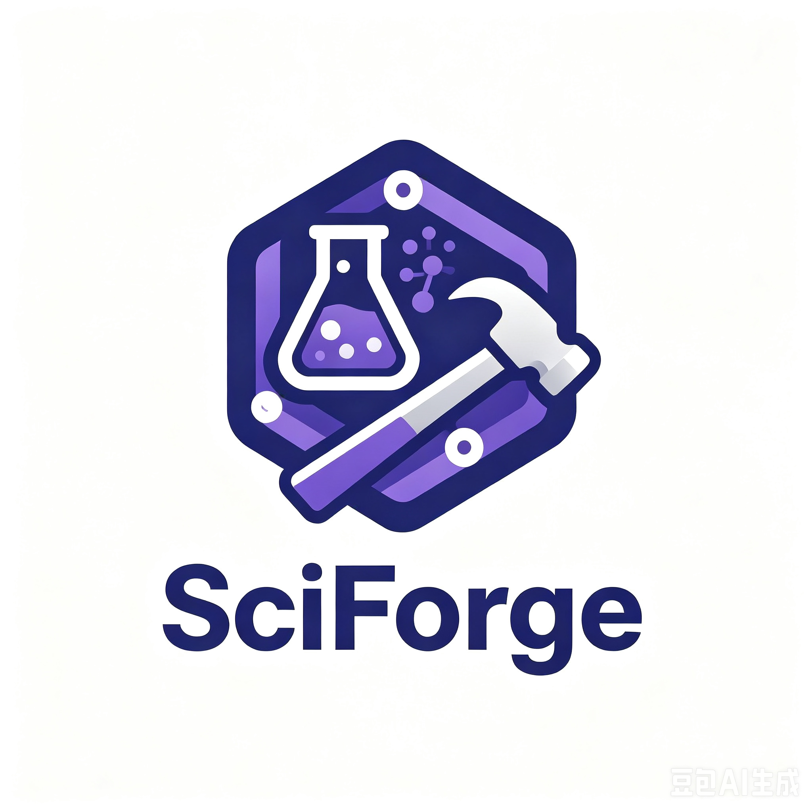

<div align="center">



# SciForge

**The AI Assistant for Scientific Research**

*Turn general-purpose AI agents into a domain-tuned scientific co-pilot.*

[](LICENSE)
[]()
[]()
[]()

</div>

---

## 🔭 What is SciForge?

**SciForge is *not* another standalone AI agent.**

It is a curated collection of **skills, prompts, workflows, tools, and configuration** that turns general-purpose coding/reasoning agents — such as **Claude Code**, **OpenAI Codex CLI**, **Cursor**, **Aider**, and similar — into a specialized assistant for **scientific research**.

If a general agent is a sharp but generic knife, SciForge is the whetstone, jig, and cookbook that shape it into a research-grade instrument: one that knows how to read papers, run analyses, draft figures, and write manuscripts *the way scientists actually work*.

## 🧩 How It Works

SciForge layers on top of the agent host you already use:

```
┌───────────────────────────────────────────────────────────┐
│                      Your Research Task                   │
├───────────────────────────────────────────────────────────┤
│   SciForge  ──  skills · prompts · workflows · tools      │
├───────────────────────────────────────────────────────────┤
│   Host Agent  ──  Claude Code · Codex · Cursor · Aider    │
├───────────────────────────────────────────────────────────┤
│                Foundation Model (LLM API)                 │
└───────────────────────────────────────────────────────────┘
```

- **Skills** — reusable, invokable capabilities (e.g. "read this arXiv paper", "draft a methods section", "generate a Nature-style figure").
- **Prompts & Personas** — carefully-crafted system prompts for common research roles (reviewer, methods writer, statistician, ...).
- **Workflows** — multi-step recipes that chain skills together (literature review → hypothesis → experiment plan → analysis → figures → draft).
- **Tools / MCP servers** — thin wrappers over arXiv, PubMed, Semantic Scholar, Zotero, matplotlib, LaTeX, etc.
- **Config presets** — drop-in `.claude/`, `AGENTS.md`, or equivalent files so your host agent picks the right defaults immediately.

## ✨ What You Get

- 📚 **Literature Intelligence** — search, summarize, and synthesize across arXiv, PubMed, Semantic Scholar.
- 🧪 **Hypothesis & Experiment Design** — turn open questions into concrete, testable plans grounded in prior work.
- 📊 **Data Analysis** — load, clean, analyze, and visualize experimental data through natural language.
- 📈 **Publication-Quality Figures** — sensible defaults for scientific plots; consistent style across a manuscript.
- ✍️ **Manuscript Drafting** — abstracts, methods, results, discussion — in the voice and structure of your field.
- 🔍 **Citation & Reference Management** — BibTeX-first, Zotero-friendly, citation-style-aware.
- 🔬 **Reproducibility First** — every analysis is scripted, versioned, and re-runnable.

## 🧭 How this project is built

SciForge has a small, deliberate architecture. If you plan to contribute or
extend it, start here:

- [`CONTEXT.md`](CONTEXT.md) — the shared vocabulary (paper, citekey, domain
  skill, micro skill, SciForge URI, …). Read this first.
- [`SKILL_AUTHORING.md`](SKILL_AUTHORING.md) — the rules every skill follows:
  CLI naming, the `--json` output contract, exit codes, the destructive-op
  checklist, when a skill should own state.
- [`docs/adr/`](docs/adr/) — the "why did they build it this way?"
  architectural decision records (hybrid opinion/contract, CLI-first, URI
  lazy resolution, layered trust model, `sf-` naming, minimum output
  contract).

The short version:

- **Skills are CLIs.** Every SciForge capability ships as an `sf-*`
  command-line tool that prints human-readable text by default and JSON on
  `--json`. Skills do not import each other.
- **State lives in domain skills.** `sf-lit` owns the paper catalog;
  future `sf-analysis` will own experiments; `sf-writing` will own
  manuscripts. Everything else is stateless "micro skills" that compose.
- **Cross-skill references are lazy.** Skills refer to each other's
  entities with `sciforge://<skill>/<id>` URIs, resolved only when read.
- **The host agent is the orchestrator.** SciForge has no daemon, no
  scheduler, no long-running process — just CLIs and file conventions.

## 🚀 Getting Started

> ⚠️ **Early development.** Interfaces are still shifting — expect breaking changes.

### 1. Pick your host agent

SciForge is designed to work with any capable coding agent. First-class targets:

- [Claude Code](https://docs.claude.com/en/docs/claude-code) (recommended)
- [OpenAI Codex CLI](https://github.com/openai/codex)
- [Cursor](https://cursor.sh) / [Aider](https://aider.chat) / others via generic `AGENTS.md`

### 2. Install SciForge

```bash
git clone https://github.com/sylcliff/SciForge.git
cd SciForge
```

### 3. Wire it into your agent

For **Claude Code**:

```bash
# Copy (or symlink) SciForge's skills and settings into your project
cp -r sciforge/.claude /path/to/your/research/project/
```

For **Codex / Cursor / Aider**:

```bash
cp sciforge/AGENTS.md /path/to/your/research/project/
```

Then just talk to your agent as usual — SciForge's skills and workflows will be discoverable.

### 4. Try a workflow

Ask your agent:

> "Use SciForge to do a literature review on protein language models from the last 12 months and draft a related-work section."

## 🗺️ Roadmap

- [ ] Core skill pack (literature, analysis, figures, writing)
- [ ] Claude Code integration (`.claude/skills/`, hooks, subagents)
- [ ] Codex CLI integration (`AGENTS.md` preset)
- [ ] Cursor / Aider presets
- [ ] MCP server for arXiv / PubMed / Semantic Scholar
- [ ] MCP server for Zotero / BibTeX
- [ ] Figure toolkit (matplotlib themes, plotly presets, TikZ helpers)
- [ ] LaTeX / Overleaf export workflow
- [ ] Reproducibility bundle exporter

## 🤝 Contributing

SciForge is a community project. Contributions of every kind are welcome:

- 🐛 Bug reports & feature requests via Issues
- 📝 New skills, prompts, or workflows
- 🔌 Adapters for additional host agents
- 📚 Docs, examples, and case studies

Please open an issue to discuss significant changes before submitting a PR.

## 📄 License

Released under the MIT License. See [LICENSE](LICENSE) for details.

## 💬 Acknowledgements

SciForge stands on the shoulders of the agent hosts and open-source scientific tools it composes — Claude Code, Codex, arXiv, matplotlib, LaTeX, and many more. Thank you to everyone whose work makes it possible.

---

<div align="center">
<sub>Made for scientists, by people who believe research should be joyful.</sub>
</div>
